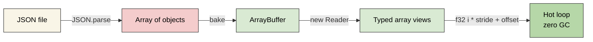
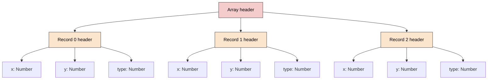
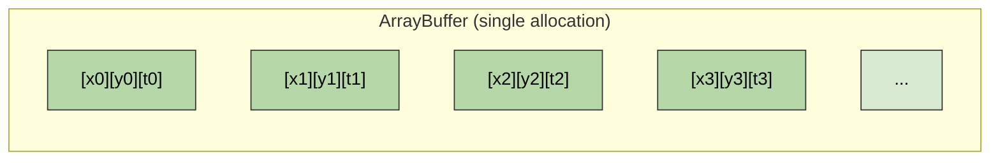

# @zakkster/lite-bake

> **Stop parsing JSON in your game loop.** Compile your massive JSON configs into flat, interleaved binary arrays for zero-GC, L1-cache-friendly memory access.

[](https://www.npmjs.com/package/@zakkster/lite-bake)
[](https://bundlephobia.com/result?p=@zakkster/lite-bake)
[](https://www.npmjs.com/package/@zakkster/lite-bake)
[](https://www.npmjs.com/package/@zakkster/lite-bake)


[](https://opensource.org/licenses/MIT)

## The bake step the ecosystem was missing

You already have JSON: a tilemap from Tiled, 50,000 spawn points from a level editor, 5,000 item definitions from a config. `JSON.parse` gives you an object graph -- scattered heap allocations, a hidden class per record, pointer chasing on every field read, and GC pauses that land as frame jitter. What was missing between the parse and the hot loop is the step that turns that graph into the thing the CPU actually wants: **one flat, interleaved `ArrayBuffer` with a fixed-width binary row per record**, read back through raw typed-array indexing with no method calls, no property lookups, and no allocations.

`lite-bake` is that step. It infers the smallest lane that holds each column exactly, lays the records out interleaved (array-of-structs), and hands you a `Reader` whose cached offsets drive a zero-instruction hot loop. No schema file, no code generation, no build step, zero runtime dependencies.

```bash
npm install @zakkster/lite-bake
```

```javascript
import { bake, Reader, Types } from '@zakkster/lite-bake';

const spawnPoints = [
  { x: 100, y: 200, type: 0, hp: 50 },
  { x: 340, y: 180, type: 1, hp: 80 },
  // ... 49,998 more
];

// Once at load time:
const baked = bake(spawnPoints, {
  schema: { x: Types.F32, y: Types.F32 }      // force F32 for pixel-accurate coords
});
const r = new Reader(baked);

// Cache offsets once:
const f32 = r.f32, u8 = r.u8;
const s32 = r.strideF32, sB = r.stride;
const OFF_X    = r.offsetF32('x');
const OFF_Y    = r.offsetF32('y');
const OFF_TYPE = r.offsetU8('type');
const OFF_HP   = r.offsetU8('hp');

// Hot loop -- ZERO allocations, ZERO GC pressure:
for (let i = 0; i < r.count; i++) {
  const base32 = i * s32, baseB = i * sB;
  const x    = f32[base32 + OFF_X];
  const y    = f32[base32 + OFF_Y];
  const type = u8 [baseB  + OFF_TYPE];
  const hp   = u8 [baseB  + OFF_HP];
  // ...spawn, update, render...
}
```

---

## Table of contents

- [Why this exists](#why-this-exists)
- [What you get](#what-you-get)
- [API reference](#api-reference)
- [Composability with the ecosystem](#composability-with-the-ecosystem)
- [Benchmarks](#benchmarks)
- [Design decisions worth knowing](#design-decisions-worth-knowing)
- [Testing](#testing)
- [What this is not](#what-this-is-not)
- [Ecosystem](#ecosystem)
- [License](#license)

---

## Why this exists

You build a tilemap in Tiled, export 50,000 enemy spawn points from a level editor, or ship a config with 5,000 item definitions. You `JSON.parse()` the file, and now:

- You have **50,000 tiny objects** on the heap. Each one has a hidden class, a map pointer, and 5-10 slots of V8 overhead.
- Every iteration of `level.spawns[i].x` chases **pointers through scattered memory** -- bad for the CPU cache.
- The first few frames after load are **janky** as the GC decides what survives.
- Accessing a nested `level.layers[0].data[i]` in your physics loop? You've already lost.

`bake()` takes your array of records and produces a single `ArrayBuffer` with one fixed-width binary row per record. You read it back through **raw typed-array indexing** -- no method calls, no property lookups, no allocations, no GC pressure.



| Feature | `JSON.parse` | **lite-bake** | FlatBuffers | Protobuf | MessagePack |
|---|---|---|---|---|---|
| Schema required upfront | No | **No** (inferred) | **Yes** (.fbs) | **Yes** (.proto) | No |
| Zero-copy random access | No | **Yes** | Yes | No | No |
| Zero-GC hot loop | No | **Yes** | Yes | No | No |
| Code generation step | No | **No** | Yes | Yes | No |
| Install size | 0 | **0 deps, ~30 kB source** | ~40 KB | ~150 KB | ~10 KB |
| Best for | Small configs | **Game data, per-frame loops** | Cross-language binary | RPC / network | Wire format |
| Learning curve | Zero | **~5 min** | High | High | Low |

`lite-bake`'s niche: **you already have JSON, you want binary-grade read performance, you don't want a build step.**

---

## What you get

- **`bake(records, opts?)`** -- compiles an array of records into one flat `ArrayBuffer`, choosing each column's lane through the inference ladder (the smallest type that holds every value exactly, widening rather than wrapping or truncating).
- **`new Reader(baked)`** -- an 8-lane view set (`f32`/`f64`/`i32`/`u32`/`i16`/`u16`/`i8`/`u8`) plus a `DataView`, with cached `offsetXxx(name)` helpers that drive raw typed-array reads in the hot loop at zero allocation.
- **`Reader.fromBytes(bytes, meta)`** -- the raw exact-layout lane: reconstruct a `Reader` from on-disk bytes, honoring `byteOffset`/`byteLength`, copying only when a view does not span its backing buffer.
- **Strict-by-default doors** -- every degenerate or lossy input is refused with one of **22 stable error codes** (`E_*` on the write side, `R_*` on the read side); `null` is never coerced to zero, leniency is opt-in via `coerce: 'zero'`.
- **The torture gate** -- `node --expose-gc test/torture.mjs` proves 0 B/op on the hot lane, 0 retained bytes across bake/read/drop cycles, and a standing ASCII-law drift guard, on the suite's canonical path.

<details>
<summary>Memory layout -- the whole point</summary>

### Before: JS object graph


Each object is a separate heap allocation. Fields are pointers. Reading one record trashes the cache for the next.

### After: one contiguous ArrayBuffer


Records are laid out back-to-back at a known byte offset. Reading record `i+1` is already in L1 cache because L1 lines are 64 bytes -- you just read record `i` from the same line.

**Stride is padded to the largest field's alignment** -- no more, no less. If your schema has an `F64`, stride is a multiple of 8. An `F32`-only schema gets stride padded to 4. An all-`U8` schema has stride equal to its field count in bytes (three `U8` fields -> stride 3); there is no forced minimum. This keeps `i * strideF64 + off` arithmetic exact for the widest lane present. On a sub-4-byte stride there is no aligned 4-byte lane, so `strideF32` and `strideU32` (computed by integer shift `stride >> 2`) are `0` -- read such tables through `r.stride` and the `u8` lane, not the F32/U32 shift lanes.

**The buffer byte length is padded up to a multiple of 8**, so that `new Float64Array(baked.buffer)` always works, even when no field is an `F64`. Costs at most 7 trailing unused bytes per baked dataset. Negligible.

**Inference reads every record.** `bake()` walks all records once to determine the smallest fitting type: for each column it tracks min/max, whether every value is an integer, whether every value survives the `Math.fround` round-trip, and whether the integer extremes stay inside `+/-(2^53-1)`. O(records x fields). For 100k records, this is single-digit milliseconds. If you already know the types and want to skip inference entirely, pass a full `opts.schema`.

</details>

---

## API reference

### `bake(records, opts?) -> Baked`

Compiles an array of records into a flat binary.

| Option | Type | Default | Notes |
|---|---|---|---|
| `opts.schema` | `{ [field]: Types.X }` | `{}` | Override inferred types. Partial allowed. Codes outside `0..7` throw `E_BAD_TYPE`; a field not in the records throws `E_UNKNOWN_FIELD`. |
| `opts.validate` | `boolean` | `false` | Explicit synonym of the strict default (same shape + value checks). Conflicts with `coerce` (`E_OPTION_CONFLICT`). |
| `opts.coerce` | `'zero'` | (unset) | Restore 1.0.x leniency: non-numbers and absent fields store `0`, extra fields drop. Numbers are never coerced, so `NaN`/`-0`/`Infinity` survive in float lanes. |

An unknown option key throws `E_UNKNOWN_OPTION` with a did-you-mean hint (never a silent ignore). Returns `{ buffer, stride, count, schema }`. Every refusal is a `LiteBakeError` carrying a stable `.code`.

#### The inference ladder

`bake()` picks the smallest typed array that fits every value in a column. Override with `opts.schema`.

| Value range in column | Inferred type | Bytes |
|---|---|---|
| All integers, `0..255` | `U8` | 1 |
| All integers, `0..65535` | `U16` | 2 |
| All integers, `0..4_294_967_295` | `U32` | 4 |
| All integers, `-128..127` | `I8` | 1 |
| All integers, `-32768..32767` | `I16` | 2 |
| All integers, `-2^31..2^31-1` | `I32` | 4 |
| All integers, beyond the 32-bit lanes up to `+/-(2^53-1)` | `F64` | 8 |
| Any integer beyond `+/-(2^53-1)` | refused: `E_UNSAFE_INTEGER` (override to `F64` to accept documented precision loss) | -- |
| Fractional values where every value survives the `Math.fround` round-trip (`1.5`, `-0.25`) | `F32` | 4 |
| Fractional values `F32` cannot represent exactly (`0.1`, `20000001.5`) | `F64` | 8 |
| Non-number (string, `null`, boolean, mixed) | refused: `E_NON_NUMERIC` by default; `coerce: 'zero'` stores `0` in an `F32` lane | 4 |

The ladder never wraps and never truncates: it picks the smallest lane that
holds the column exactly, widening integers to `F64` up to `+/-(2^53-1)` and
doubles to `F64` when `Math.fround` would lose them. A column carrying
`NaN`/`Infinity` always takes a float lane.

**When to override:**
- Pixel-accurate coordinates you want kept in 4 bytes even when a double appears -> force `F32` to SHRINK (accepting `Math.fround` quantization).
- An inferred integer column beyond `+/-(2^53-1)` you accept lossy -> force `F64` (the `E_UNSAFE_INTEGER` escape hatch). Doubles that genuinely need `F64` are now inferred for you.
- You want the binary layout stable regardless of record values -> override everything.

```javascript
bake(records, {
  schema: {
    x: Types.F32,
    timestamp: Types.F64,
    level: Types.U8,
  }
});
```

### Error codes

Every door throws a `LiteBakeError` (an `Error` subclass) with a `.code`. Catch by code, not by message.

| Code | When |
|---|---|
| `E_INPUT` | `records` is not a non-empty array |
| `E_NOT_A_RECORD` | a record is not a non-null, non-array object |
| `E_EMPTY_RECORD` | record 0 has zero own keys |
| `E_NON_NUMERIC` | a field value is not a number (strict mode) |
| `E_MISSING_FIELD` | a record is missing a field record 0 declares |
| `E_UNEXPECTED_FIELD` | a record carries a field record 0 does not declare |
| `E_UNKNOWN_OPTION` | `opts` has a key other than `schema`/`validate`/`coerce` |
| `E_OPTION_VALUE` | an `opts` value is out of its domain |
| `E_OPTION_CONFLICT` | `validate: true` and `coerce: 'zero'` both set |
| `E_UNKNOWN_FIELD` | `schema` override names a field not in the records |
| `E_BAD_TYPE` | `schema` override value is not a Types code `0..7` |
| `E_UNSAFE_INTEGER` | an all-integer column reaches past `+/-(2^53-1)`; override to `F64` to accept precision loss |
| `E_LANE_MISMATCH` | a number cannot ride the field's integer lane exactly (out of range, fractional, or non-finite) |
| `R_UNKNOWN_FIELD` | Reader asked for a field the schema does not have |
| `R_WRONG_TYPE` | Reader asked for a field under the wrong lane width |
| `R_INPUT` | `baked`/`meta` is not a non-null object, or `buffer`/`bytes` is not an accepted binary type |
| `R_BAD_STRIDE` | `stride` is not a positive integer, or is not a multiple of the schema's max lane alignment |
| `R_BAD_COUNT` | `count` is not a non-negative integer |
| `R_BAD_LENGTH` | `buffer` byteLength is not a multiple of 8 |
| `R_TRUNCATED` | `count` rows at `stride` bytes do not fit in the buffer |
| `R_BAD_SCHEMA` | `schema` is not a non-empty array of well-formed, aligned, in-stride, non-overlapping fields |
| `R_ROW_OUT_OF_RANGE` | `get()`/`row()` index is not an integer in `[0, count)` |

### The `Types` enum

Every lane has a code `0..7`, a name, and a byte width. Use the name in a `schema` override (`{ x: Types.F32 }`); a code outside `0..7` throws `E_BAD_TYPE`.

| Code | Lane | Bytes |
|---|---|---|
| 0 | `F32` | 4 |
| 1 | `F64` | 8 |
| 2 | `I32` | 4 |
| 3 | `I16` | 2 |
| 4 | `I8` | 1 |
| 5 | `U32` | 4 |
| 6 | `U16` | 2 |
| 7 | `U8` | 1 |

### `new Reader(baked)`

| Property | Type | Purpose |
|---|---|---|
| `r.count` | `number` | Record count |
| `r.stride` | `number` | Bytes per record |
| `r.strideF32` / `strideU32` | `number` | Stride in 4-byte units |
| `r.strideF64` | `number` | Stride in 8-byte units |
| `r.strideU16` | `number` | Stride in 2-byte units |
| `r.f32` / `f64` / `i32` / `u32` / `i16` / `u16` / `i8` / `u8` | `*Array` | Views onto the same `ArrayBuffer` -- pick the one matching your field type |
| `r.dv` | `DataView` | For irregular or init-only reads |

| Method | Returns | Hot-loop safe? |
|---|---|---|
| `r.offsetBytes(name)` | Byte offset within one record | yes (once, cache the result) |
| `r.offsetF32(name)` etc. | Offset in element units | yes (once, cache the result) |
| `r.get(i, name)` | Value | no -- string lookup + branch |
| `r.row(i)` | Plain object | no -- allocates |

All `offsetXxx(name)` helpers **type-check** the field. `offsetF32('tag')` on a `U8` field throws -- this catches schema-reads-as-wrong-type bugs at init, not in the hot loop.

`get(i, name)` and `row(i)` enforce one bounds policy: `i` must be an integer in `[0, count)`, or they throw `R_ROW_OUT_OF_RANGE` (no silent padding read, no fractional truncation, no raw `RangeError`). The raw typed-array lane (`f64[i * strideF64 + off]`) is caller-owned by design and stays unguarded -- bounds are the price of the zero-instruction hot loop.

The constructor is a coherence door: an incoherent `baked` (bad buffer/stride/count/length/schema) is refused with a stable `R_*` code before any view is built, and the schema is snapshotted so later mutation of `baked.schema` cannot move a field.

### `Reader.fromBytes(bytes, meta)`

```js
const r = Reader.fromBytes(readFileSync('table.bin'), meta); // meta = { stride, count, schema }
```

Reconstruct a `Reader` from on-disk bytes. Accepts an `ArrayBuffer` or a `Uint8Array` (a Node `Buffer` **is** a `Uint8Array`), **honoring `byteOffset`/`byteLength`** -- so a pooled `readFileSync` `Buffer` is safe. It reuses the buffer zero-copy when given an `ArrayBuffer` or a full-span view, and copies only the viewed range when the view does not span its backing buffer, so `r.buffer` never exposes bytes outside the dataset. Anything else (`DataView`, another `TypedArray`, a string, `null`) refuses with `R_INPUT`; the resolved buffer then runs the same coherence doors as the constructor.

### The canonical hot-loop pattern

**This is the pattern.** Memorise it. Every deviation costs frames.

```javascript
// ONE TIME, AT LOAD
const r   = new Reader(baked);
const f32 = r.f32;                // keep locals
const u8  = r.u8;
const s32 = r.strideF32;          // stride in 4-byte words
const sB  = r.stride;             // stride in bytes (for u8)
const OFF_X    = r.offsetF32('x');
const OFF_TYPE = r.offsetU8('type');

// PER FRAME
for (let i = 0; i < r.count; i++) {
  const x = f32[i * s32 + OFF_X];
  const t = u8 [i * sB  + OFF_TYPE];
  // ...
}
```

**Do:**
- Cache `new Reader(baked)`, the lane views (`f32`, `u8`), the strides, and every `offsetXxx(name)` once at load time.
- Read fields with raw typed-array indexing: `f32[i * s32 + OFF_X]`.
- Pick one stride per loop body (bytes vs 4-byte words) and comment which lane it drives.

**Don't:**
- Call `r.get(i, 'x')` in a per-frame loop -- it is a string lookup plus a branch. Use `f32[i * s32 + OFF_X]`.
- Call `r.row(i)` for anything except `console.log` -- it allocates a plain object. Read individual fields instead.
- Recompute `r.offsetF32('x')` every iteration -- cache `OFF_X` once.
- Reach for `DataView` in the hot path -- use typed-array indexing.
- Mix up `strideF32` and `stride` (bytes vs words) in the same expression.

**Strict by default (since 1.1.0).** `bake()` refuses `null`, `undefined`, a missing field, or an extra field with a coded `LiteBakeError` (`E_NON_NUMERIC`, `E_MISSING_FIELD`, `E_UNEXPECTED_FIELD`) naming the record index and field. `null` is not zero. To restore the 1.0.x zero-fill and extra-drop behavior, pass `{ coerce: 'zero' }` -- absent/non-number values then store `0` and extra fields drop. `{ validate: true }` is an explicit synonym of the strict default (it now also checks values, not just key sets).

**Strings are refused by default (since 1.1.0).** A string-valued field is non-numeric, so it throws `E_NON_NUMERIC` by default. Under `{ coerce: 'zero' }` it stores an `F32` `0` (never the old `+v` coercion -- `'42.5'` does not become `42.5`). String tables are delegated to the LBK1 `U32` interned-string lanes (see [What this is not](#what-this-is-not)).

---

## Composability with the ecosystem

The whole path, records to a GPU-ready buffer, is flat typed arrays end to end:

```javascript
import { bake, Reader, Types } from '@zakkster/lite-bake';

// 1. Bake once at load time (interleaved vertex-ish records).
const verts = [
  { x: 0.0, y: 0.0, u: 0, v: 0, tile: 3 },
  { x: 1.0, y: 0.0, u: 1, v: 0, tile: 3 },
  // ... thousands more
];
const baked = bake(verts, { schema: { x: Types.F32, y: Types.F32 } });

// 2. Cache offsets once.
const r   = new Reader(baked);
const f32 = r.f32, u8 = r.u8;
const s32 = r.strideF32, sB = r.stride;
const OFF_X = r.offsetF32('x'), OFF_Y = r.offsetF32('y'), OFF_TILE = r.offsetU8('tile');

// 3. Zero-GC hot loop over the raw lanes.
for (let i = 0; i < r.count; i++) {
  const x = f32[i * s32 + OFF_X];
  const y = f32[i * s32 + OFF_Y];
  const tile = u8[i * sB + OFF_TILE];
  // ...cull, transform, batch...
}

// 4. Upload the whole buffer to the GPU in one call.
// gl.bufferData(gl.ARRAY_BUFFER, baked.buffer, gl.STATIC_DRAW);
```

`baked.buffer` is a raw `ArrayBuffer` you can hand straight to `gl.bufferData` or `queue.writeBuffer` with no intermediate copy. For per-frame interleaved vertex staging specifically, see the sibling [`@zakkster/lite-batch-buffer`](https://www.npmjs.com/package/@zakkster/lite-batch-buffer).

**Shipping baked data to disk.** This is the raw exact-layout lane. Write `new Uint8Array(baked.buffer)` to a file and save the metadata alongside it (`JSON.stringify({ stride: baked.stride, count: baked.count, schema: baked.schema })`). Reconstruct with `Reader.fromBytes(readFileSync(file), meta)` -- it honors `byteOffset`, so a pooled `readFileSync` `Buffer` (Node's internal Buffer pool hands back views with a nonzero `byteOffset`) is read correctly, and it copies only when the view does not span its backing buffer.

Two hazards come with the raw lane, both by design. **`Reader.fromBytes` verifies SHAPE, never CONTENT -- there is no magic and no marker, so a wrong file or the wrong `meta` reads back as plausible garbage, silently.** And the bytes are native-endian: they are only portable between same-endianness machines (see the endianness note below). If you need a self-describing container that *detects* a wrong file (magic at both ends, strict decoding, optional CRC-32C integrity), use the LBK1 format via [`@zakkster/lite-bake-stream`](#ecosystem).

`bake()` writes with `DataView.setFloat32(..., littleEndian)` where `littleEndian` is detected at module load. Typed-array reads (`f32[i]`) always use native endianness. In-process bake-and-read round-trips work on either endianness, but the baked BYTES are **not portable across endianness** and carry no byte-order marker -- a buffer baked on one endianness reads silently wrong on the other. For portable interchange use the little-endian-specified LBK1 container (see [Ecosystem](#ecosystem)).

**In the browser:** zero Node-specific APIs. Use any bundler, or load directly as an ES module.

<details>
<summary>Zero-GC design notes</summary>

| Operation | Steady-state allocation |
|---|---|
| `bake()` | one `ArrayBuffer` + the schema objects, all cold (init time, never in a loop) |
| `new Reader(baked)` | 8 typed views + 1 `DataView`, ~600 B one-time -- built only after every coherence door passes |
| `offsetXxx(name)` | cold init lookups (type-check + cache); call once, keep the local |
| `get(i, name)` / `row(i)` | **allocate by design** -- the debug tier, never for the hot loop |
| the raw typed-array hot lane (`f32[i * s32 + off]`) | **0 B/op** |

Provenance-stamped gate numbers -- torture gate, 2026-09-02, `node --expose-gc test/torture.mjs`: maxMajor 0 / maxPauseMs 4 / maxArrayBuffersGrowth 0 over a 1M-cell container; lite-leak tracker 0 retained over 4096 bake/read/drop cycles.

The 8 lane views are built eagerly in the constructor, not lazily -- a branch or getter indirection on the accessor path would tax every read to save a one-time ~600 B that is dwarfed by the buffer itself; see [`decisions/0009-eager-views.md`](decisions/0009-eager-views.md).

</details>

---

## Benchmarks

Measured on Node 22, 50,000 records (random x/y/type/hp), 100 loop passes per trial, 5 trials, 3 warmups. Run it yourself: `node benchmark/bench.js`.

### What's reliable

| Metric | JS objects | **lite-bake** | Result |
|---|---|---|---|
| Heap footprint | ~2.3 MB (approx object graph) | 586 KB (one `ArrayBuffer`) | **~4× smaller, consistently** |
| Init (from already-parsed records) | -- | ~8 ms | One-time cost at load |
| Object-access run-to-run variance | 3-5% | -- | V8 inline caches are stable |
| Baked-access run-to-run variance | -- | occasionally 40-50% (single slow trial, rest stable) | Worth knowing |

### What's *not* a dramatic speedup

> **Honest disclosure:** on a synthetic monomorphic hot loop over a dataset that fits in L2 cache, V8's object JIT is exceptional. You should expect baked and object access to land **within noise of each other** (~0.9×-1.1× speedup). We measured:
>
> - Object access: ~15-17 ms median (~300 Mop/s)
> - Baked access: ~16-17 ms median (~300 Mop/s)
>
> If a library tells you it's "5× faster than objects" on this kind of microbenchmark, be skeptical.

### Where baked access *does* reliably win

1. **Large datasets that spill L2/L3 cache.** Once your working set is bigger than ~1 MB per core, pointer chasing through object graphs hits main memory; baked access doesn't.
2. **Polymorphic shapes.** If your records don't all have identical keys in identical order, V8 falls off the monomorphic fast path and object access slows significantly.
3. **GC-sensitive timing.** Baked access allocates zero. In a frame where other code is allocating (particle spawns, string building, closures), baked reads won't contend for allocation or trigger young-gen collections.
4. **Binary serialization.** Writing `new Uint8Array(baked.buffer)` to disk is one syscall. Serializing an object graph means `JSON.stringify` -- orders of magnitude slower.
5. **GPU upload.** `baked.buffer` goes straight to `gl.bufferData` or `queue.writeBuffer`. No intermediate copy.

**TL;DR:** the performance argument for lite-bake is **predictability and memory**, not raw throughput in a hot cache. The memory win is always real. The speed win depends on your workload.

**Is this actually faster than V8's JIT?** Usually not, and the honest answer is the point. V8's object JIT is excellent, so on a monomorphic hot loop over a cache-resident dataset baked and object access land within noise of each other (the measured ~0.9x-1.1x above -- there is no "2x faster" here). The wins are elsewhere: cache behaviour on datasets that spill L2/L3, consistent zero allocation, and the absence of GC pauses that show up as frame-timing jitter. Reach for lite-bake for predictability and memory, not for raw throughput in a hot cache.

---

## Design decisions worth knowing

- [`0001-value-policy.md`](decisions/0001-value-policy.md) -- `bake()` refuses any value it cannot store faithfully; leniency (`coerce: 'zero'`) is opt-in and `null` is never zero.
- [`0002-row-bounds.md`](decisions/0002-row-bounds.md) -- `get()`/`row()` refuse an out-of-range index with `R_ROW_OUT_OF_RANGE`; the raw typed-array lane stays caller-owned and unguarded.
- [`0003-view-honesty.md`](decisions/0003-view-honesty.md) -- `Reader.fromBytes` accepts `ArrayBuffer | Uint8Array`, honors `byteOffset`/`byteLength`, and copies only when a view does not span its buffer.
- [`0004-stride-minimum.md`](decisions/0004-stride-minimum.md) -- stride is the max field alignment, not a forced 4-byte minimum; the old false doc line dies.
- [`0005-inference-ladder.md`](decisions/0005-inference-ladder.md) -- `bake()` infers the smallest lane that holds a column exactly and never wraps; the fit door makes every int-lane store provably exact.
- [`0006-wire-format.md`](decisions/0006-wire-format.md) -- lite-bake ships no wire format; LBK1 is the suite's container, and the raw `fromBytes` lane says its no-magic hazard out loud.
- [`0007-aos-over-soa.md`](decisions/0007-aos-over-soa.md) -- interleaved array-of-structs (one cache line per record); a columnar SoA mode is parked until a real consumer exists.
- [`0008-native-endianness.md`](decisions/0008-native-endianness.md) -- native byte order for the zero-instruction hot loop; the portable path is LBK1, spec'd little-endian.
- [`0009-eager-views.md`](decisions/0009-eager-views.md) -- the 8 lane views build eagerly in the constructor (~600 B, after every door passes), never lazily behind a per-read branch.

---

## Testing

121 deterministic tests, all pass, plus a torture gate that proves both leak-freedom and the zero-GC hot-loop claim.

```bash
npm test              # 121 node:test cases
npm run torture       # @zakkster/lite-leak + lite-gc-profiler: 0 B/op + retention witness
npm run torture:control  # BAKE_TORTURE_BREAK=1 -- proves the gate can fail
npm run verify        # test + torture, the publish gate
npm run bench         # object-vs-baked throughput + memory footprint
npm run example       # the canonical spawn-table walkthrough
```

Uses Node's built-in `node:test` runner. Zero dependencies. The 121 tests cover input validation, type inference, the inference ladder + fit-door refusals (`test/InferenceLadder.test.js`), round-trip correctness, layout/alignment, schema overrides, the strict-default write-side doors (`test/Doors.test.js`), the Reader coherence + bounds + `fromBytes` doors (`test/ReaderDoors.test.js`), Reader helpers, and integration. Should complete in under a second.

The torture gate runs ten tiers strictly sequentially (the GC profiler measures one window at a time):

- **t0 laws** -- metamorphic bake/read invariants: what goes in reads back out.
- **t1 degenerate** -- degenerate values and the inference-ladder boundaries.
- **t2 layout** -- stride/alignment laws across the schema space.
- **t3 adversarial** -- corrupt baked objects, the row-bounds policy, and the `fromBytes` round-trip.
- **t4 abuse** -- API abuse against the write-side and reader doors.
- **t5 fuzz** -- differential fuzz: the fixed lane plus hostile-name / shape / schema-cross oracles.
- **t6 alloc** -- the zero-alloc gate (`maxArrayBuffersGrowth: 0`) over the hot loop.
- **t7 soak** -- soak plus the lite-leak retention witness.
- **t8 cross** -- cross-package parity against the pinned `@zakkster/lite-bake-stream@1.6.0`, plus the export/BYTES/docs and ASCII-law (check h) drift guards.
- **t9 controls** -- every gate is proven able to fail in-process, plus the error-code inventory gate.

`BAKE_TORTURE_BREAK=1 node --expose-gc test/torture.mjs` injects a fault and must exit non-zero -- a gate that cannot fail is decorative. Replay a failing seed with `TORTURE_SEED=<n> node --expose-gc test/torture.mjs`.

### What the tests cover

| Category | What it verifies | Why it matters |
|---|---|---|
| Input validation | `bake([])`, `bake(null)`, `bake({})` all throw | Never silently corrupt |
| Type inference | Boundaries at 255/256, 65535/65536, -128/-129, 4294967295/4294967296, `+/-2^53`, and the `Math.fround` rung | Correct smallest-fitting lane, no wrap |
| Round-trip | Values go in -> come out bit-identical (ints) or float-precise | Core correctness claim |
| F64 alignment | F64 + U32 mix, stride padding, typed-array reads match DataView | The *critical* fix -- untested, this regresses silently |
| Layout | Buffer size padded to 8, offsets aligned, sorted by size | Memory model matches the README |
| Schema overrides | Force F64, partial override still infers the rest | Public API contract |
| Validate mode | On/off behaviour, missing/extra fields throw when on | Dev-time safety net |
| Reader helpers | Type-checked `offsetXxx`, `get`, `row`, unknown field throws | Prevent schema-type-mismatch bugs |
| Integration | 1k and 50k records via hot-loop pattern match `.get()` | End-to-end sanity |

### Red flags that mean something is wrong

| Symptom | Likely cause | Check |
|---|---|---|
| `R_BAD_LENGTH` thrown from `new Reader` | The buffer byteLength is not a multiple of 8 -- usually a truncated or partially-written file | Re-save the full buffer (`new Uint8Array(baked.buffer)`); reconstruct with `Reader.fromBytes`. (Old lite-bake threw a raw `RangeError` from `Float64Array` here; since 1.1.1 the Reader fails closed with a coded refusal.) |
| `E_LANE_MISMATCH` thrown from `bake` | A value does not fit the integer lane you overrode to (out of range, fractional, or non-finite) -- values cannot silently wrap anymore | Widen the lane, or override to `F32`/`F64` |
| `E_UNSAFE_INTEGER` thrown from `bake` | An inferred integer column reaches past `+/-(2^53-1)` | Override the column to `F64` to accept documented precision loss |
| Coords quantized after bake | You overrode a double column to `F32` (inference now widens drift-prone doubles to `F64` for you) | Leave it `F64` for precision, or keep `F32` to shrink |
| `field 'x' has wrong type` thrown from `offsetF32` | You asked for F32 offset on a non-F32 field | Match field type to offset helper, or pass schema override |

### Adding your own tests

Drop a `.test.js` file in `test/`. Any file the `node --test` runner discovers will run. Example:

```javascript
import { test } from 'node:test';
import assert from 'node:assert/strict';
import { bake, Reader } from '../Bake.js';

test('my game: enemy table round-trips', () => {
  const enemies = [ /* ... */ ];
  const r = new Reader(bake(enemies));
  assert.equal(r.get(0, 'hp'), enemies[0].hp);
});
```

---

## What this is not

- **Not a wire format.** lite-bake mints no serialization container -- the suite's one wire format is LBK1, owned by `@zakkster/lite-bake-stream` ([`decisions/0006`](decisions/0006-wire-format.md)). `serialize()` / `deserialize()` are resolved by that same decision: the raw `Reader.fromBytes` lane is the exact-layout escape hatch, and there is no second format.
- **Not columnar.** The layout is interleaved AoS ([`decisions/0007`](decisions/0007-aos-over-soa.md)); a struct-of-arrays mode is **parked** until a workload needs it. String tables are **delegated** -- LBK1 `U32` lanes already intern strings per shard. Matrix / normalized-int vertex attributes are **parked**.
- **Not faster-than-JIT.** On a cache-resident monomorphic loop, baked and object access are within noise (see [Benchmarks](#benchmarks)). The win is memory and predictability, not raw throughput.
- **Not a general validator.** The doors refuse exactly what would corrupt a baked buffer (shape, type, range, coherence) -- they are not a JSON-schema engine, and they check nothing beyond what `bake()`/`Reader` need to be safe.
- **Not a homogeneous-column tool.** If you have one homogeneous numeric column, use a `Float32Array` directly. lite-bake is for **heterogeneous records** -- mixing floats, ints, and byte-sized flags in one logical row.

---

## Ecosystem

`lite-bake` and [`@zakkster/lite-bake-stream`](https://www.npmjs.com/package/@zakkster/lite-bake-stream) share a data model and a torture-pinned boundary. They do different jobs and neither replaces the other.

**Ownership.** The LBK1 container -- the suite's *only* wire format (frozen v1: magic at both ends, strict decoding, optional CRC-32C integrity) -- and its evolution belong to `lite-bake-stream`. The `Types` enum and the in-memory row layout belong here.

**Shared.** The concept of interleaved, fixed-stride typed lanes, and the F64 lane-width row layout: cell-for-cell parity is pinned by torture t8 on **both** sides (each package's own gate), so a byte written into an F64 lane by one is read identically by the other.

**Divergent, pinned as deliberate.** The lane-code tables differ -- wire `lane_kind` F64=1 is the ONLY shared code point; wire U32=3 vs `Types.U32`=5; LBK1 assigns 2/3/4 to F32/U32/U8 where `Types` assigns 2/3/4 to I32/I16/I8. The U32 lane *meaning* differs: in LBK1 it is an index into a per-shard interned string table; here it is a plain number. The lane sets differ: LBK1 v1's numeric lanes are F64-only plus the U32 string index (F32/U8 reserved), while `lite-bake` compiles eight lanes.

**Jobs.** `lite-bake-stream` ingests gigabyte JSON into queryable LBK1 containers (persistence, interchange, range queries). `lite-bake` compiles already-parsed records in memory for the zero-GC hot loop. Neither reads the other's format by API -- t8 pins the boundary so any convergence is a deliberate diff, not drift.

| | `lite-bake` | `@zakkster/lite-bake-stream` |
| --- | --- | --- |
| input | in-memory records | gigabyte JSON / NDJSON |
| output | live in-memory `ArrayBuffer` | LBK1 container (file / wire) |
| wire format | none (raw `Reader.fromBytes` lane) | LBK1 (magic, strict decode, optional CRC-32C) |
| U32 lane | plain number | interned string-table index |
| lane set | eight lanes | F64 + U32 string index (F32/U8 reserved) |

## License

MIT (c) Zahary Shinikchiev <shinikchiev@yahoo.com>
